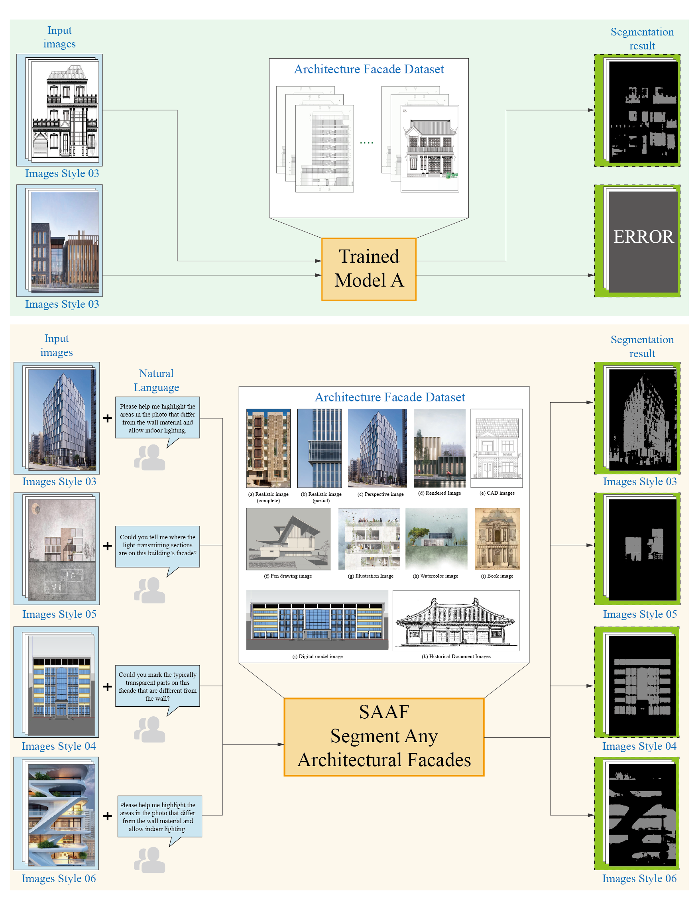

# Segment-Any-Architecture-Facade
Abstract: *In the context of the digital development of architecture, the automatic segmentation of walls and windows is a key step in improving the efficiency of building information models and computer-aided design. This study proposes an automatic segmentation model for building facade walls and windows based on multimodal semantic guidance, called Segment Any Architectural Facades (SAAF). First, SAAF has a multimodal semantic collaborative feature extraction mechanism. By combining natural language processing technology, it can fuse the semantic information in text descriptions with image features, enhancing the semantic understanding of building facade components. Second, we developed an end-to-end training framework that enables the model to autonomously learn the mapping relationship from text descriptions to image segmentation, reducing the influence of manual intervention on the segmentation results and improving the automation and robustness of the model. Finally, we conducted extensive experiments on multiple facade datasets. The segmentation results of SAAF outperformed existing methods in the mIoU metric, indicating that the SAAF model can maintain high-precision segmentation ability when faced with diverse datasets. Our model has made certain progress in improving the accuracy and generalization ability of the wall and window segmentation task. It is expected to provide a reference for the development of architectural computer vision technology and also explore new ideas and technical paths for the application of multimodal learning in the architectural field.*


[**Paper**]() | [**Project Page**]() | [**Model Weights**]() | [**Huggingface Demo**]() |


*Figure 1) Graphic Abstract of Segement Any Architecture Facade (SAAF).*


*Figure 2) Schematic diagram of the reference segmentation dataset.*


*Figure 3) The pipeline of SAAF. Given the input image and text query, the multimodal LLM (e.g, LLaVA ) generates text output. The last-layer embedding for the <SEG> token is then decoded into the segmentation mask via the decoder..*


*Figure 4) The Number of Floor Plans in Each Category.*


*Figure 5) The Overall Scores of  Different Floor Plan Types.*


*Figure 6) Scores of Two Typical Layouts.*


*Figure 7) Qualitative Results of Floor Plans Generated by Different Methods on Class-Conditional Task.*


*Figure 8) Qualitative Results of Floor Plans Results on Text-Conditional Task. The detailed prompt input is listed in the appendix.*


*Figure 9) Six Typical Cases of Unreasonable Room Layouts.*


*Figure 10) Average Human Evaluation Score on Class-Conditional Task and Human Evaluation Win Rate on Class-Conditional Task*


*Figure 11) By coordinating multiple FP-LLaMas and FloorPlanChats, the process simulates the interaction between a human architect and a user, iteratively modifying the design until it meets satisfaction.*


*Figure 12) Different Floor Plan Representation Configurations in the Dataset..*


## TODO List

- [x] Release part of ArchiMetricsNet dataset. 
- [ ] Release FloorPlan-LLaMa inference code and pretrain weights.
- [ ] Upload ArchiMetricsNet training dataset.
- [ ] Release FloorPlann-LLaMa code.


## Inference

```
python FloorPlan_LLaMa_Sample.py --dataset ArchiMetricsNet --batch_size 32  --color_configuration 0 --model_path ckpts/exp/model10000.pt --num_samples 64
```
## Train

```
python FloorPlan_LLaMa_Train.py --dataset ArchiMetricsNet --batch_size 32  --color_configuration 0 
